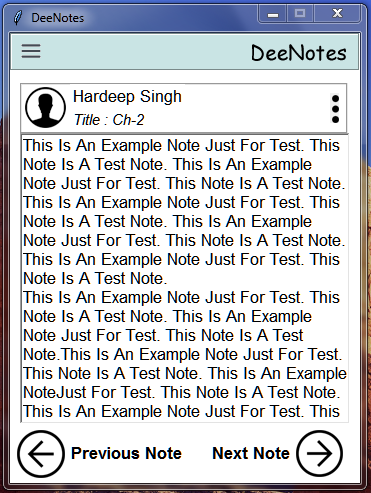
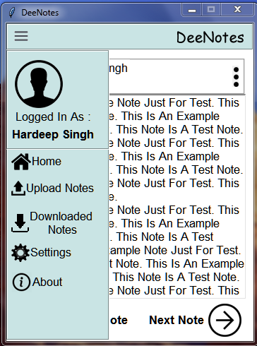

# DeeNotes

## Summary
This application can be used to share and view Notes with each other online. The problem of getting notes in school or collages is a major issue. This application can resolve the problem.

## Features

1. Upload Notes

2. View Notes uploaded by anyone.

3. Download notes

4. Settings

5. Delete Notes

## Requirements
1. Python 3.7 or above

2. Socket module

3. Tkinter module

## Screenshots

